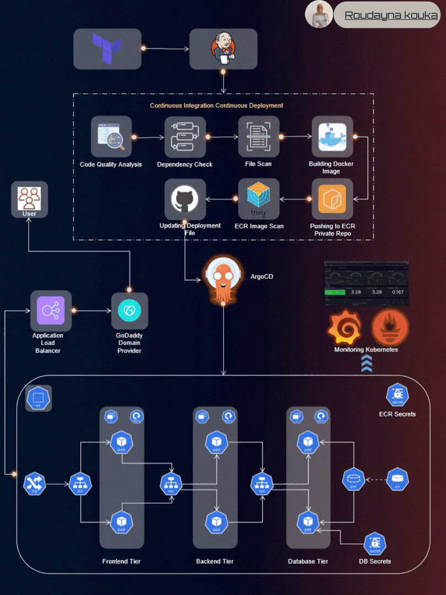

Welcome to my Three-Tier Web Application Deployment project! 👩‍💻

This repository showcases the design and deployment of a scalable three-tier web application using ReactJS, NodeJS, and MongoDB, deployed on AWS EKS with a complete DevOps pipeline.

📚 Table of Contents
Application Code
Jenkins Pipeline Code
Jenkins Server Terraform
Kubernetes Manifests Files
Project Details
💻 Application Code

The Application-Code directory contains the full source code of the application:

Frontend built with ReactJS
Backend powered by NodeJS
Database managed with MongoDB
⚙️ Jenkins Pipeline Code

The Jenkins-Pipeline-Code directory includes CI/CD pipelines used to:

Build the application
Run code quality checks
Push Docker images
Deploy automatically to Kubernetes
☁️ Jenkins Server Terraform

Inside Jenkins-Server-TF, Terraform scripts are used to:

Provision AWS infrastructure
Deploy and configure Jenkins server
☸️ Kubernetes Manifests Files

The Kubernetes-Manifests-Files directory contains:

Deployment configurations
Services and Load Balancer setup
Persistent storage configuration
🛠️ Project Details
🔧 Tools & Technologies
Terraform & AWS CLI
Jenkins (CI/CD)
SonarQube (Code Quality)
Docker & Kubernetes
AWS EKS & ECR
Helm (Monitoring setup)
Prometheus & Grafana
ArgoCD (GitOps)
🚀 High-Level Workflow
IAM user configuration & secure access
Infrastructure provisioning using Terraform
Jenkins setup and pipeline automation
EKS cluster creation and deployment
Docker image management with ECR
Monitoring using Prometheus & Grafana
GitOps workflow using ArgoCD
📈 Key Achievements
End-to-end DevOps pipeline implementation
Scalable cloud-native deployment
Automated CI/CD workflow
Monitoring and observability integration
Secure and production-ready architecture
👩‍💻 Author

Roudayna Kouka